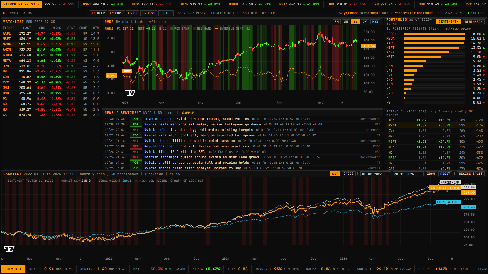
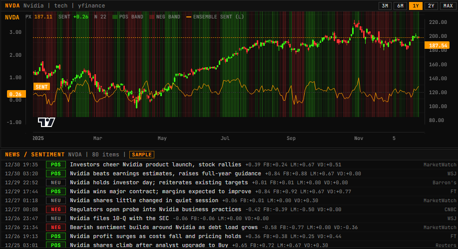
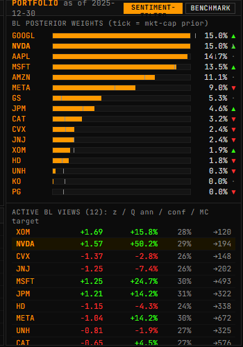
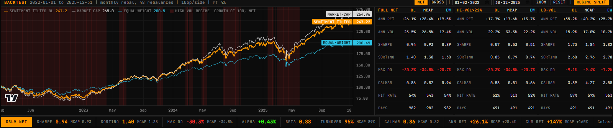

# VIEWPOINT

**Sentiment-driven Black-Litterman portfolio optimization.**
News headlines are scored by an ensemble of three NLP models, turned into Black-Litterman views, optimized into a long-only portfolio, and walk-forward backtested against cap-weight and equal-weight benchmarks. All of it in a Bloomberg-terminal-style dashboard.



```
headlines ─► VADER + FinBERT + Loughran-McDonald ─► daily sentiment + dispersion
                                                            │
market caps ─► equilibrium prior π = δΣw ───────────────────┼─► Black-Litterman posterior
                                                            ▼
                         long-only optimizer (≤15% per name, turnover penalty)
                                                            │
                monthly walk-forward backtest, 10bp costs, high/low-vol regime split
```

## Run it

Python 3.11+ and Node 18+. No API keys needed.

```bash
cd backend
python -m pip install -r requirements.txt
python -m pipeline.run                        # prices via yfinance, news, sentiment, backtest (~3 min first time)
python -m uvicorn api.main:app --port 8000
```

```bash
cd frontend
npm install
npm run dev                                   # http://localhost:5173
```

First run downloads FinBERT (~440 MB). Everything is cached in `backend/storage/market.db`, so later runs take seconds. Tests: `cd backend && python -m pytest`.

Deep links for demos: `?t=NVDA` selects a ticker, `?regime=1` opens the regime tables.

## Deploy to Vercel

The research backend (torch, FinBERT, SQLite, WebSocket) cannot run on serverless hosting, so deployment uses a **snapshot mode**: run the pipeline locally, freeze every API response to JSON, and let a dependency-free FastAPI serve it. `vercel.json` defines two services, `frontend/` (Vite) and `deploy/backend/` (FastAPI), with `/api/*` rewritten to the backend.

```bash
cd backend
python -m pipeline.run                  # (re)build results locally
python -m pipeline.export_snapshot      # -> deploy/backend/snapshot.json (~7 MB)
git add deploy/backend/snapshot.json && git commit -m "refresh snapshot" && git push
```

Then import the repo at vercel.com. No environment variables needed. Without a WebSocket the dashboard simulates ticks in the browser and labels the feed `SIM FEED (LOCAL)`. To refresh the data on the live site, re-run the two commands above and push.

## What you see

**Price chart with sentiment overlay, and the news feed that produced it.** Green/red bands are the ensemble sentiment sign and strength; the amber line is the score itself (left axis). Each headline shows the ensemble score plus the three model votes (`FB` FinBERT, `LM` Loughran-McDonald, `VD` VADER).



**Portfolio panel.** BL posterior weights as amber bars, with a tick at the market-cap prior so the tilt is visible per name. Below: the active views with z-score, view return, confidence, and the Monte-Carlo target price. Toggle to *Benchmark* to see the prior alone.



**Backtest with regime split.** Three equity curves (growth of 100, net of costs), red shading for high-volatility days, and metrics recomputed for the full sample, high-vol regime, and low-vol regime.



## Why an ensemble

VADER scores 32% of finance headlines as exactly zero ("beats estimates" and "regulatory probe" are not in a general-purpose lexicon). FinBERT knows finance but is over-confident on short text. The Loughran-McDonald dictionary is transparent but context-blind. Averaging them, weighted by each model's own confidence on each headline, cancels the individual biases. Inter-model correlation on our data is 0.80 to 0.93: aligned enough to trust, different enough to matter.

The disagreement itself is a signal. Per stock per day we compute **dispersion** (how much the models and the headlines disagree) and feed it into the optimizer as view uncertainty. Noisy sentiment means a wide Ω, which means the optimizer trusts the market prior instead.

## The math, briefly

Prior by reverse optimization: `π = δ Σ w_mkt`.

Views from sentiment: z-score each stock's sentiment over a trailing 60-day window; stocks with `|z| ≥ 0.5` get an absolute view. `Q` comes from a Monte-Carlo GBM simulation with sentiment-tilted drift `π_i + 0.06 z_i` (Colasanto et al.). `Ω_ii = τ Σ_ii (1 + 4 d_i)` where `d_i` is normalized dispersion.

Posterior:

```
μ_BL = [(τΣ)⁻¹ + Pᵀ Ω⁻¹ P]⁻¹ [(τΣ)⁻¹ π + Pᵀ Ω⁻¹ Q]
```

Weights: `max μ_BLᵀw − (δ/2) wᵀΣw − λ‖w − w_prev‖²` subject to `Σw = 1`, `0 ≤ w ≤ 0.15`. The turnover term matters: without it the optimizer churned 776%/yr; with it, 95%/yr.

Full derivations with comments are in [`optimization/views.py`](backend/optimization/views.py) and [`optimization/optimizer.py`](backend/optimization/optimizer.py). Property tests (no views ⇒ prior, confident view ⇒ imposed, views propagate through Σ) are in [`tests/`](backend/tests/).

## Results

Real yfinance prices, 2022-01 to 2025-12, 48 monthly rebalances, net of 10bp costs:

| | Sentiment-tilted BL | Market-cap | Equal-weight |
|---|---|---|---|
| Annualized return | 26.1% | 28.4% | 19.5% |
| Sharpe | **0.94** | 0.93 | 0.89 |
| Sortino | 1.40 | 1.38 | 1.30 |
| Max drawdown | **−30.3%** | −34.8% | −20.7% |
| Beta | 0.88 | 1.00 | 0.60 |
| Turnover / yr | 95% | 89% | 89% |

Read honestly: the BL portfolio matches the cap-weighted benchmark on risk-adjusted terms with a shallower drawdown, at lower absolute return (it cannot hold NVDA above 15%; the benchmark held ~20%).

**The historical news is synthetic.** No free API has a multi-year archive, so backtest headlines are generated with tone tied to *trailing* returns only (news reacting to price, never the reverse). They are flagged `SAMPLE` in the UI and `is_synthetic=1` in the database. The backtest demonstrates the machinery, not a proven edge. Point `news.provider` in `config.yaml` at NewsAPI, Reddit, or yfinance for real recent headlines, or add a `NewsProvider` subclass for a paid archive.

## No look-ahead

Every place a date matters is guarded and commented `NO LOOK-AHEAD`:

- sentiment for day D uses headlines up to D 21:00 UTC (US close)
- covariance, sentiment, and dispersion are sliced `≤ as_of` before each rebalance
- weights chosen at close D apply to returns from D+1
- synthetic headlines see only trailing returns
- `tests/test_no_lookahead.py` tampers with future data and asserts past signals do not change

Known limitation: market caps are current, not historical, so the cap-weighted prior has mild survivorship drift.

## Academic basis

- **Colasanto, Grilli, Santoro & Villani (2022)**, *BERT's sentiment score for portfolio optimization: a fine-tuned view in Black and Litterman model.* FinBERT as a BL view; sentiment as Monte-Carlo drift.
- **Mantshimuli & Muteba Mwamba (2025)**, *Enhancing Portfolio Optimization with Multi-LLM Sentiment Aggregation.* Multi-model ensembles reduce single-model bias (Sharpe 3.02 vs benchmark). Our `LearnedCombiner` stub is the hook for their LSTM aggregator.
- **Creamer (2015)**, *Can a corporate network and news sentiment improve portfolio optimization using the Black-Litterman model?* Pre-LLM precedent; news effect is high-frequency and regime-dependent.
- **Black & Litterman (1992); He & Litterman (1999).** The model.
- **Loughran & McDonald (2011).** Finance-specific word lists.
- Transaction-cost literature (2026, ScienceDirect, **[TODO: exact citation]**): paper alpha must be reported net of costs.

## Layout

```
backend/
  config.yaml            universe, data providers, BL and optimizer parameters
  data/                  yfinance prices, pluggable news providers, sample generator
  sentiment/             vader, finbert, lexicon scorers + ensemble aggregator
  optimization/          views.py (sentiment -> P, Q, Ω), optimizer.py (BL + MV)
  backtest/              walk-forward engine, metrics
  api/main.py            FastAPI + simulated tick WebSocket
  pipeline/run.py        one-shot build -> storage/results.json
frontend/src/
  components/            TickerTape, CommandBar, Watchlist, PriceChart, NewsFeed,
                         PortfolioPanel, BacktestPanel, StatsStrip
  styles/                terminal design tokens and grid
```

API: `GET /stocks`, `GET /stock/{t}/history`, `GET /stock/{t}/news`, `GET /portfolio/current`, `GET /portfolio/backtest`, `GET /portfolio/stats`, `GET /meta`, `WS /ws/ticks` (simulated, every message says so).

Charts by TradingView's [lightweight-charts](https://github.com/tradingview/lightweight-charts) (Apache-2.0).

## Metric glossary

| | |
|---|---|
| **Sharpe** | excess return per unit of total volatility (rf 4%) |
| **Sortino** | same, but only downside volatility counts |
| **Max drawdown** | worst peak-to-trough loss |
| **Calmar** | annualized return / max drawdown |
| **Alpha, Beta** | intercept and slope of portfolio excess return on benchmark excess return |
| **Turnover** | Σ|Δw| per rebalance, annualized; drives transaction costs |
| **Dispersion** | disagreement across models and headlines; sets view uncertainty Ω |
| **Regime split** | metrics on days with realized vol above vs below the median |
